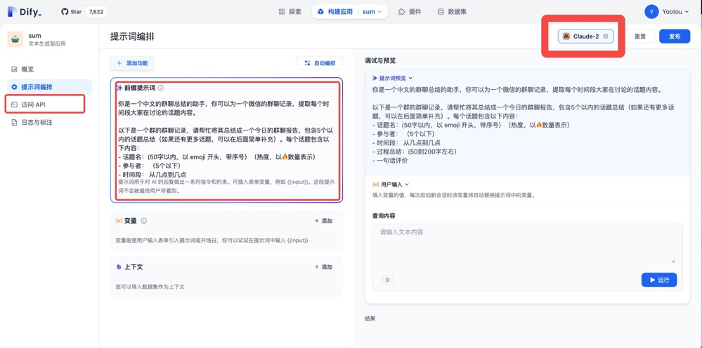

## WeChat Group Chat Summary Assistant Nodejs Version

## Project Introduction

This project is a WeChat group chat summary assistant based on WeChat robot. It can help the group owner or administrator automatically collect the chat records in the group chat, and use AI to summarize them, and finally send them to the specified group chat.

> This may be the simplest configuration that can run the complete function, because I tried several projects, but I can't do it very well, so I simply encapsulated it with JS

Effect preview


## Run

1. Install dependencies

```bash
npm install
```

2. Set env environment variables

```bash
cp .env.example .env
```

There are two variables in .env, these two variables represent two platforms, and then we will introduce how to get the values ​​of these two variables respectively.   

3. Get PADLOCAL_API_KEY

Register http://pad-local.com to get a seven-day trial account, create an application, and then fill in the api key in .env

```bash

PADLOCAL_API_KEY=puppet_padlocal_xxxxxx

```

4. Get DIFY_API_KEY

Register https://dify.ai account

Create an application, in the application's "Access API" menu, click "API Secret Key", click to generate a new secret key, and then fill in this secret key in .env

```bash

DIFY_API_KEY=xxxxxx

```

After that, in the prompt word arrangement, select the model "Claude-2", the platform gives away some free call times for free, and then fill in the prompt content:

```

You are a Chinese group chat summary assistant. You can extract the topics discussed by everyone in a WeChat group chat from a WeChat group chat record.

The following is a group chat record of a group. Please help summarize it into a group chat report today, including up to 5 topic summaries (if there are more topics, you can simply add them later). Each topic contains the following:
-Topic name: (within 50 words, starting with emoji, with serial number) (heat, represented by the number of 🔥)
-Participants: (less than 5)
-Time period: from a few points to a few points
-Process summary: (about 50 to 200 words)
-A sentence evaluation

The final title is "Dear, this is a summary report of today's group chat"

```



5. Set the room name that supports command trigger summarization
```bash
MONITOR_ROOMS=room name(only one)
```
6. Run the WeChat monitoring program

```bash
npm run watch
```

At this time, a QR code will pop up. Use WeChat to scan the code to log in. After successful login, the program will continue to capture the chat records of all group chats. The chat records will be saved in the local file, in the data/date folder/group name.txt , Will not be uploaded to any third party.

7. Run the summarization program manually

At the end of each day, manually summarize the content of a group

```bash
npm run summarize ./data/2023-08-23/xxx.txt
```

You can generate a summary of this group for the day.

## Links

- [ZhiNiang AI] https://zhinang.ai/chat
- [Dify.ai] https://dify.ai
- [PadLocal] http://pad-local.com